# Awesome Scientific Figure

 

A curated list of scientific figures in research papers.

## Contributing
Pull requests are welcome, please feel free to raise [pull requests](https://github.com/nehSgnaiL/awesome-scientific-figure/pulls) to add new recommendation.

## Geographic map

### 2021-Xu-Tour Manag
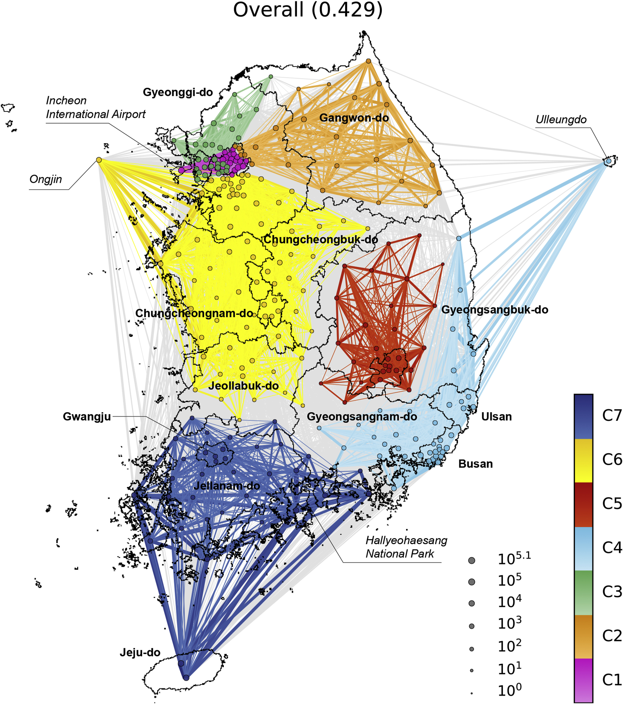

<b>Citation & Details</b>

**Citation (APA):** Xu, Y., Li, J., Belyi, A., & Park, S. (2021). Characterizing destination networks through mobility traces of international tourists—A case study using a nationwide mobile positioning dataset. *Tourism Management*, 82, 104195.

**Link:** [[paper]](https://doi.org/10.1016/j.tourman.2020.104195)

**Tag:** `flow`

**Color:** #2A4291 #F8CA13 #C00005 #64C9EA #58AF63 #E98A02 #DE24CE

---

### 2021-Xu-Ann AAG
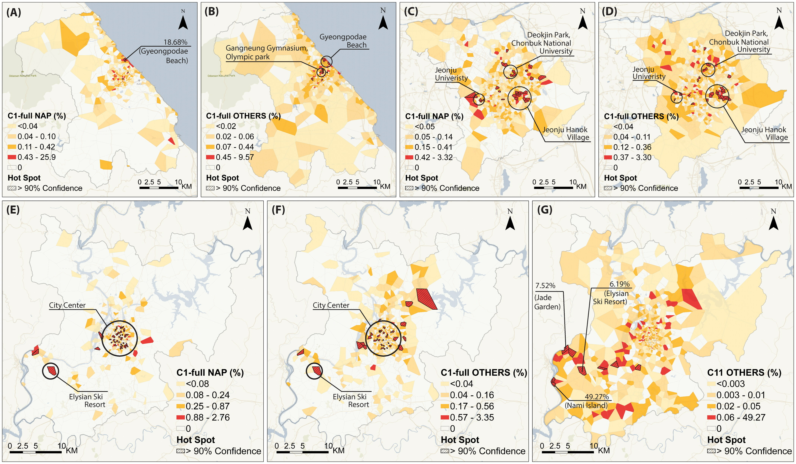

<b>Citation & Details</b>

**Citation (APA):** Xu, Y., Li, J., Xue, J., Park, S., & Li, Q. (2021). Tourism geography through the lens of time use: A computational framework using fine-grained mobile phone data. *Annals of the American Association of Geographers*, 111(5), 1420-1444.

**Link:** [[paper]](https://doi.org/10.1080/24694452.2020.1812372)

**Tag:** `notation`

**Color:** #FDEDBD #FCDA9B #FDBD39 #E83D39 #F7F7EF

---

### 2016-Jiang-PNAS
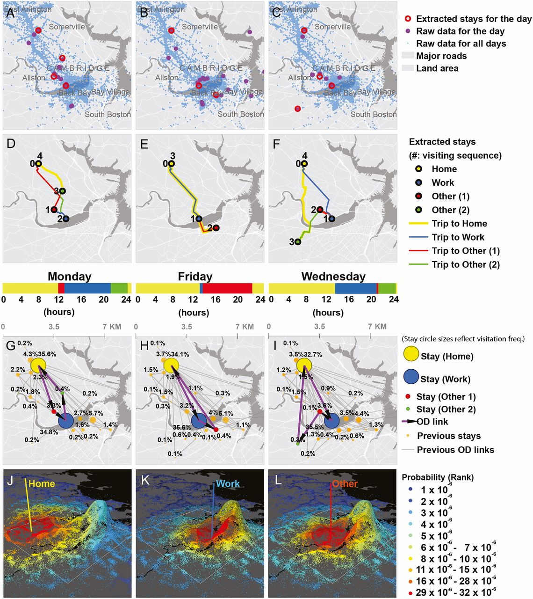

<b>Citation & Details</b>

**Citation (APA):** Jiang, S., Yang, Y., Gupta, S., Veneziano, D., Athavale, S., & González, M. C. (2016). The TimeGeo modeling framework for urban mobility without travel surveys. *Proceedings of the National Academy of Sciences*, 113(37), E5370-E5378.

**Link:** [[paper]](https://doi.org/10.1073/pnas.1524261113)

**Tag:** `prob`

**Color:** #EFE541 #296AB2 #E40519 #75B728

---

### 2019-Xu-CEUS
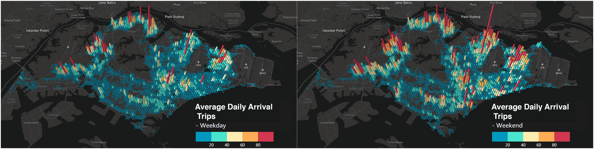

<b>Citation & Details</b>

**Citation (APA):** Xu, Y., Chen, D., Zhang, X., Tu, W., Chen, Y., Shen, Y., & Ratti, C. (2019). Unravel the landscape and pulses of cycling activities from a dockless bike-sharing system. *Computers, Environment and Urban Systems*, 75, 184-203.

**Link:** [[paper]](https://doi.org/10.1016/j.compenvurbsys.2019.02.002)

**Tag:** `3D`

**Color:** #0098BD #4BE3CE #FEEDB0 #FEAC54 #D1374F

---

## Combination Fig

### 2020-Gibbs-Nat Commun
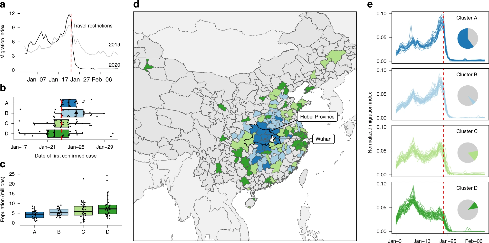

<b>Citation & Details</b>

**Citation (APA):** Gibbs, H., Liu, Y., Pearson, C. A., Jarvis, C. I., Grundy, C., Quilty, B. J., ... & Eggo, R. M. (2020). Changing travel patterns in China during the early stages of the COVID-19 pandemic. *Nature Communications*, 11(1), 1-9.

**Link:** [[paper]](https://doi.org/10.1038/s41467-020-18783-0)

**Tag:** `cluster`

**Color:** #1E78B5 #A6CEE3 #B4DF8A #32A02D

---

### 2022-Yabe-CEUS
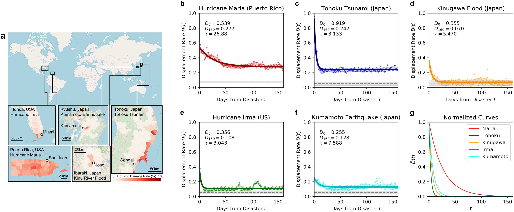

<b>Citation & Details</b>

**Citation (APA):** Yabe, T., Jones, N. K., Rao, P. S. C., Gonzalez, M. C., & Ukkusuri, S. V. (2022). Mobile phone location data for disasters: A review from natural hazards and epidemics. *Computers, Environment and Urban Systems*, 94, 101777.

**Link:** [[paper]](https://doi.org/10.1016/j.compenvurbsys.2022.101777)

**Tag:** `cross`

**Color:** #FE0505 #0B0CFE #FF9D03 #007701 #03FFFE

---

### 2022-Tegally-Science
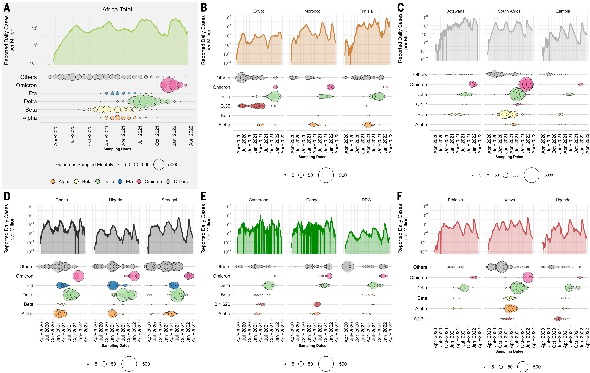
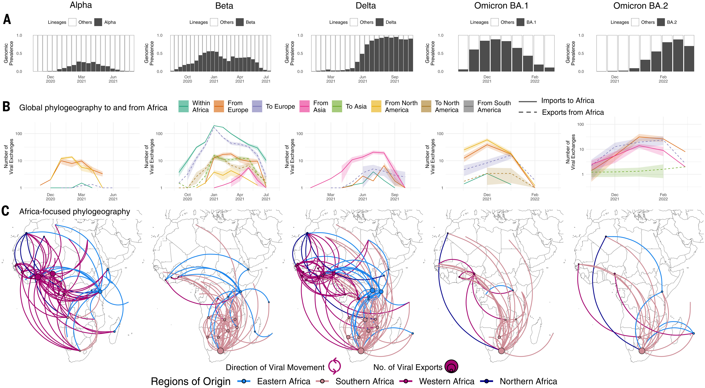

<b>Citation & Details</b>

**Citation (APA):** Tegally, H., San, J. E., Cotten, M., Tegomoh, B., Mboowa, G., Martin, D. P., ... & Omunakwe, H. E. (2022). The evolving SARS-CoV-2 epidemic in Africa: Insights from rapidly expanding genomic surveillance. *Science*, 378(6615), eabq5358.

**Link:** [[paper]](https://doi.org/10.1126/science.abq5358)

**Tag:** `period`

**Color:** #FDAE61 #FFFFBF #ACDDA5 #2E84BC #EE6AA6 #BEBEBE

#189E78 #DA5F00 #7570B3 #E7288A #66A51E #E5AA05 #A6751D #666666

---

### 2019-Yin-Nature
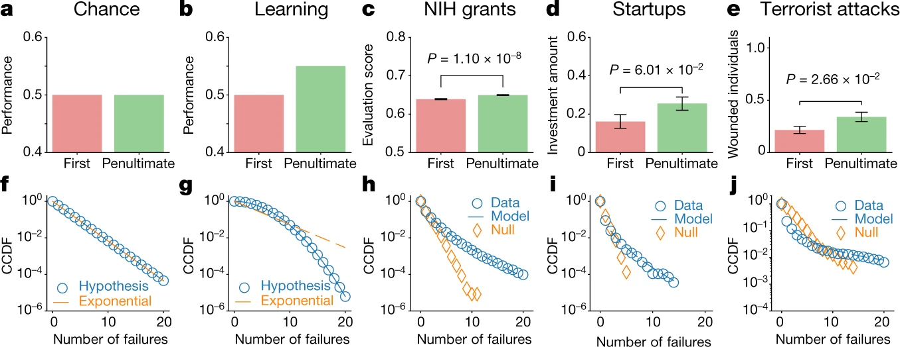

<b>Citation & Details</b>

**Citation (APA):** Yin, Y., Wang, Y., Evans, J. A., & Wang, D. (2019). Quantifying the dynamics of failure across science, startups and security. *Nature*, 575(7781), 190-194.

**Link:** [[paper]](https://doi.org/10.1038/s41586-019-1725-y)

**Tag:** `font`

**Color:** #EA9493 #95CF95

#3081AF #F18125

---

### 2020-Alessandretti-Nature
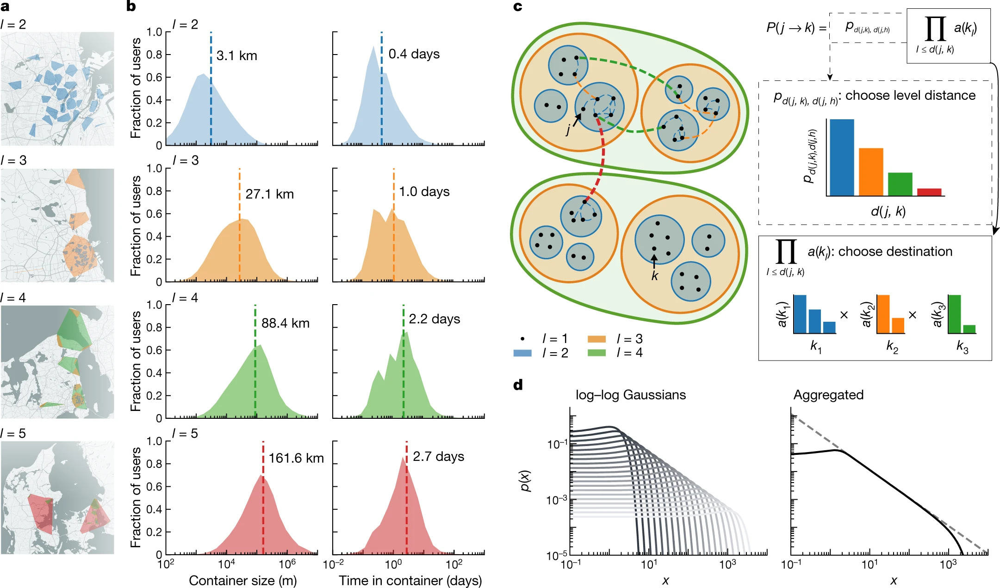

<b>Citation & Details</b>

**Citation (APA):** Alessandretti, L., Aslak, U., & Lehmann, S. (2020). The scales of human mobility. *Nature*, 587(7834), 402-407.

**Link:** [[paper]](https://doi.org/10.1038/s41586-020-2909-1)

**Tag:** `echo`

**Color:** #2177B5 #FF800E #2BA02B #D72927

---

### 2022-Ren-Tour Manag
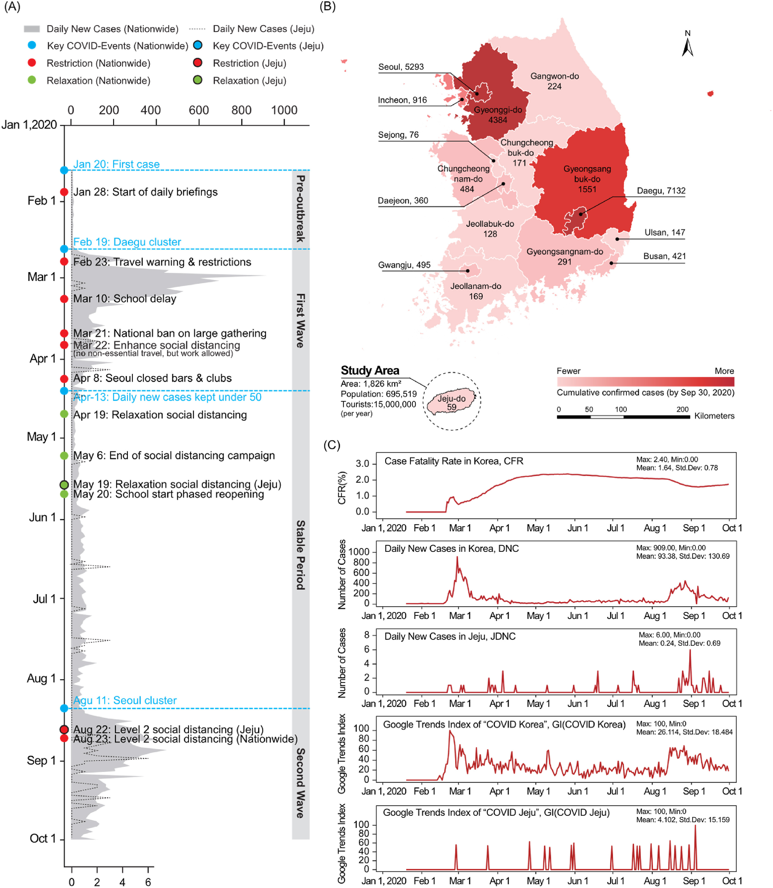

<b>Citation & Details</b>

**Citation (APA):** Ren, M., Park, S., Xu, Y., Huang, X., Zou, L., Wong, M. S., & Koh, S. Y. (2022). Impact of the COVID-19 pandemic on travel behavior: A case study of domestic inbound travelers in Jeju, Korea. *Tourism Management*, 92, 104533.

**Link:** [[paper]](https://doi.org/10.1016/j.tourman.2022.104533)

**Tag:** `event`

---

### 2025-Chen-Cities
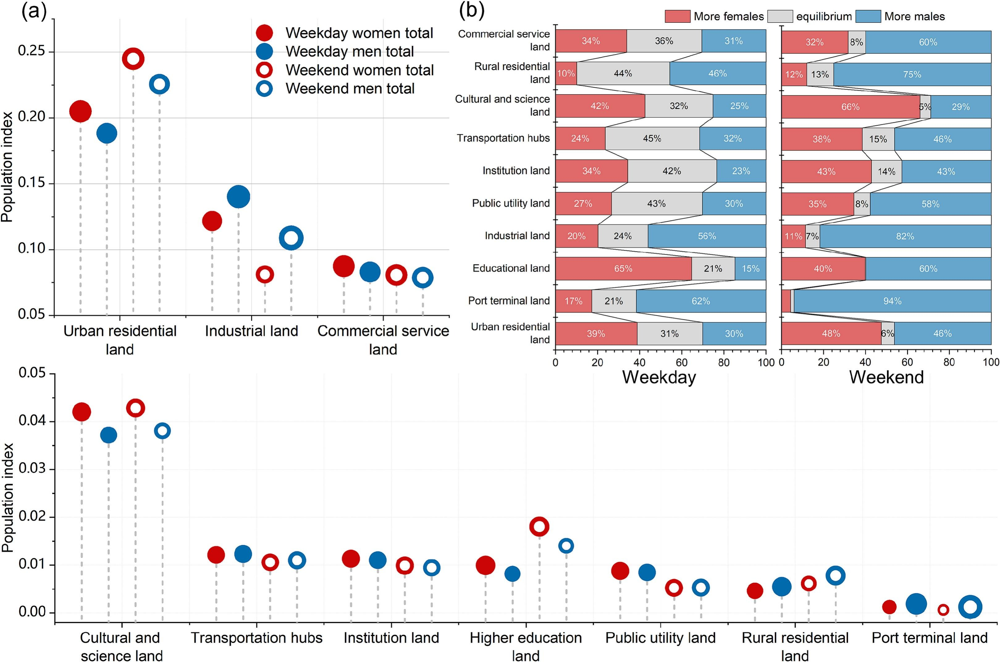

<b>Citation & Details</b>

**Citation (APA):** Chen, Y., Zhang, H., Wang, G., Jiang, S., Chen, L., & Zhang, L. (2025). Gendered urban spaces: Unveiling gender segregation through time, space, and behavior-A case study of Zhuhai, China. *Cities*, 166, 106241.

**Link:** [[paper]](https://doi.org/10.1016/j.cities.2025.106241)

**Tag:** `contrast`

---

### 2025-Cui-NC
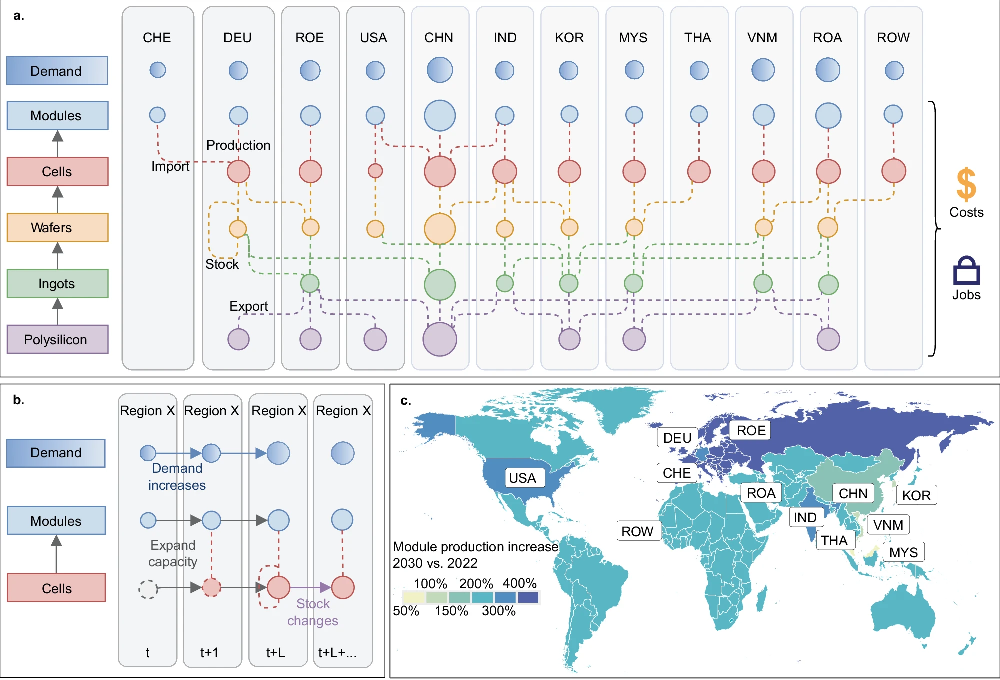

<b>Citation & Details</b>

**Citation (APA):** Cui, C., Lonergan, K.E. & Sansavini, G. (2025). Policy-driven transformation of global solar PV supply chains and resulting impacts. *Nat Commun* 16, 6742.

**Link:** [[paper]](https://doi.org/10.1038/s41467-025-61979-5)

**Tag:** `process`

---

## Scatter

### 2010-Song-Nat Phys
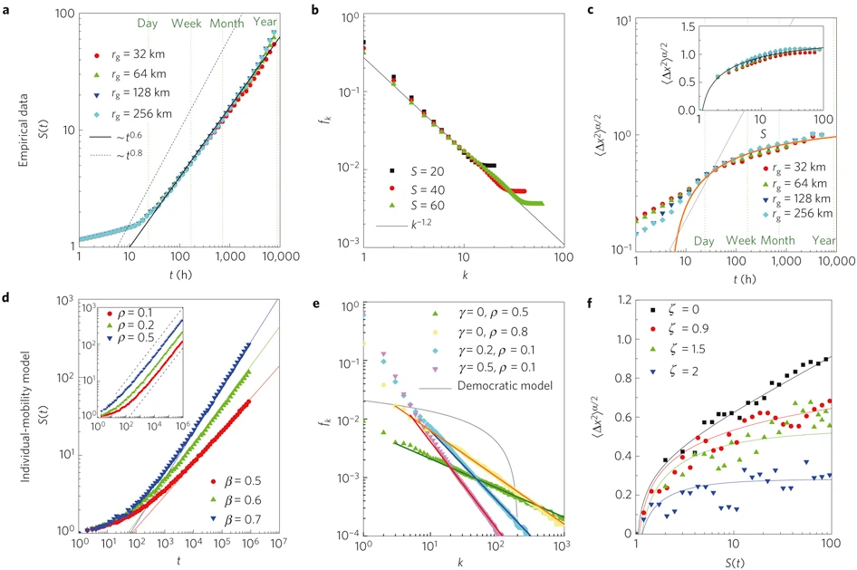

<b>Citation & Details</b>

**Citation (APA):** Song, C., Koren, T., Wang, P., & Barabási, A. L. (2010). Modelling the scaling properties of human mobility. *Nature Physics*, 6(10), 818-823.

**Link:** [[paper]](https://doi.org/10.1038/nphys1760)

**Tag:** `fit`

---

### 2009-Wang-Science
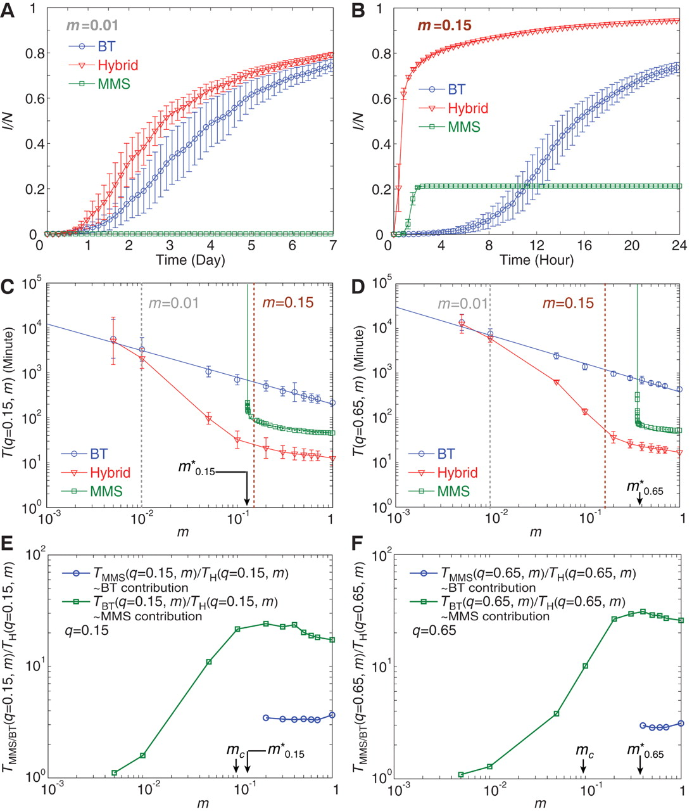

<b>Citation & Details</b>

**Citation (APA):** Wang, P., González, M. C., Hidalgo, C. A., & Barabási, A. L. (2009). Understanding the spreading patterns of mobile phone viruses. *Science*, 324(5930), 1071-1076.

**Link:** [[paper]](https://doi.org/10.1126/science.1167053)

**Tag:** `fit`

**Color:** #375294 #D93431 #1F7E46

---

### 2025-Ibrahim-Fundam Res
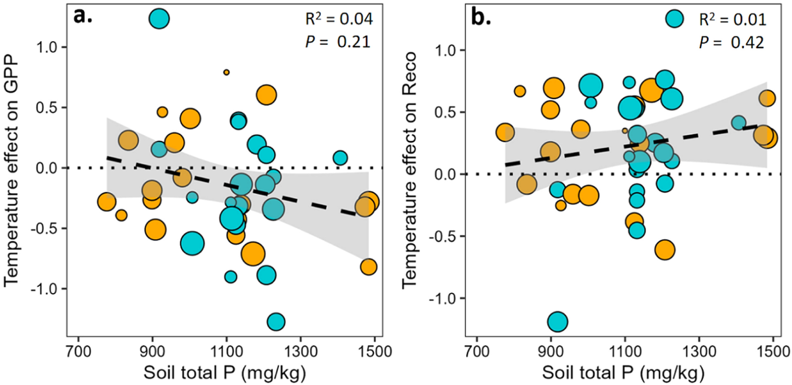

<b>Citation & Details</b>

**Citation (APA):** Ibrahim, M. M., & Hou, E. (2025). Soil phosphorus regulates summer CO2 flux response to air temperature in nitrogen-poor northern permafrost ecosystems. *Fundamental Research*.

**Link:** [[paper]](https://doi.org/10.1016/j.fmre.2025.04.005)

**Tag:** `fit`

**Color:** #00CBD2 #FFAA01

---

### 2026-Liang-Travel Behav Soc

<b>Citation & Details</b>

**Citation (APA):** Liang, S., Xu, Y., Li, G., Zhang, X., & Li, Q. (2026). Predicting short-term urban bike sharing demand in a coupled continuous and network space. *Travel Behaviour and Society*, 42, 101152.

**Link:** [[paper]](https://doi.org/10.1016/j.tbs.2025.101152)

**Tag:** `trend`

**Color:** #1dbde6 #f1515e

---

## Boxplot

### 2022-Xu-CEUS
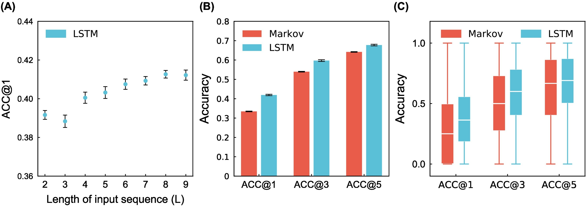

<b>Citation & Details</b>

**Citation (APA):** Xu, Y., Zou, D., Park, S., Li, Q., Zhou, S., & Li, X. (2022). Understanding the movement predictability of international travelers using a nationwide mobile phone dataset collected in South Korea. *Computers, Environment and Urban Systems*, 92, 101753.

**Link:** [[paper]](https://doi.org/10.1016/j.compenvurbsys.2021.101753)

**Tag:** `comparison`

**Color:** #E95C49 #5AC0D7

---

### 2022-Jin-Emerg Microbes Infect
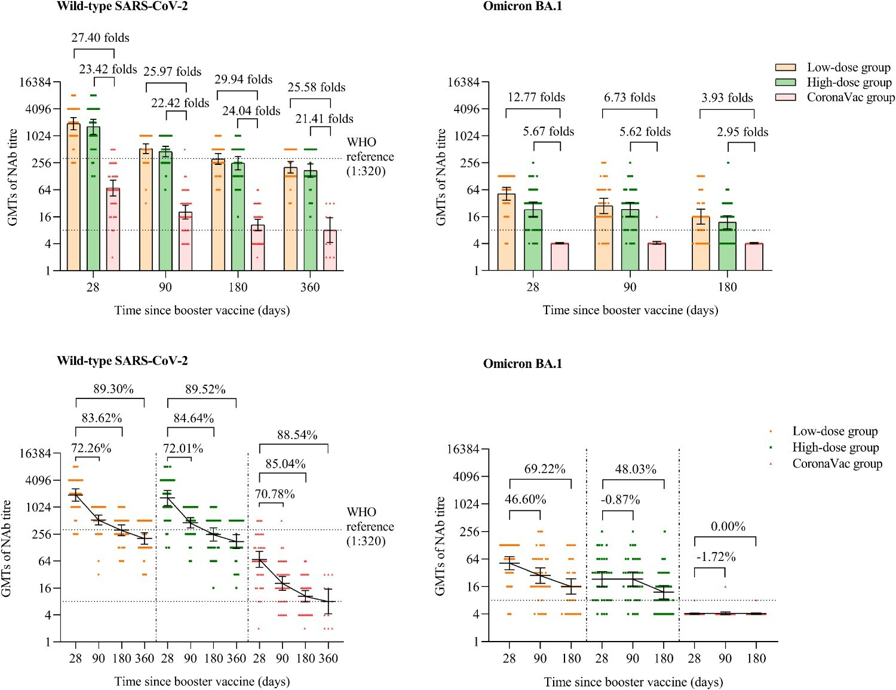

<b>Citation & Details</b>

**Citation (APA):** Jin, L., Tang, R., Wu, S., Guo, X., Huang, H., Hou, L., ... & Zhu, F. (2022). Antibody persistence and safety after heterologous boosting with orally aerosolised Ad5-nCoV in individuals primed with two-dose CoronaVac previously: twelve-month analyses of a randomized controlled trial. *Emerging Microbes & Infections*, (just-accepted), 1-20.

**Link:** [[paper]](https://doi.org/10.1080/22221751.2022.2155251)

**Tag:** `comparison` `confidence`

**Color:** #FEE0BE #A8DCA5 #FFE1E0

---

## Other publications

### 2019-Raval-FT

<b>Citation & Details</b>

**Citation:** Raval, A., Spero, J., & Campbell, C. (2019). Pollution: the race to clean up the shipping industry. *Financial Times*, 9-10.

**Link:** [[article in newspaper]](https://www.ft.com/content/642b6b62-70ab-11e9-bf5c-6eeb837566c5)

**Tag:** `flow`

---

### 2024-ElonMusk-Economist
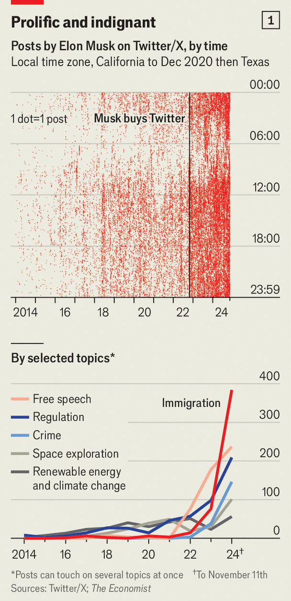

<b>Citation & Details</b>

**Citation:** Elon Musk's transformation, in his own words. (2024, Nov 21). *The Economist*

**Link:** [[article in newspaper]](https://www.economist.com/briefing/2024/11/21/elon-musks-transformation-in-his-own-words)

**Tag:** `heatmap`

---

## Classical

### 2012-Fang-J Transp Geog
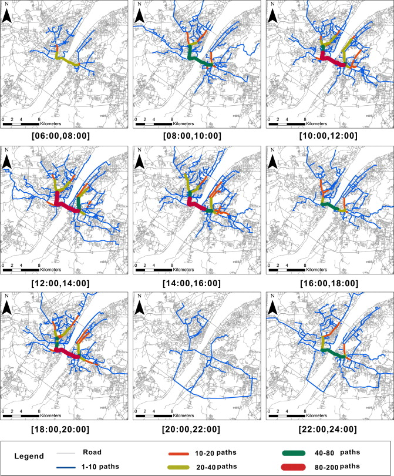

<b>Citation & Details</b>

**Citation (APA):** Fang, Z., Shaw, S. L., Tu, W., Li, Q., & Li, Y. (2012). Spatiotemporal analysis of critical transportation links based on time geographic concepts: a case study of critical bridges in Wuhan, China. *Journal of Transport Geography*, 23, 44-59.

**Link:** [[paper]](https://doi.org/10.1016/j.jtrangeo.2012.03.018)

**Tag:** `flow`

---

### 2015-Alexander-Transp Res
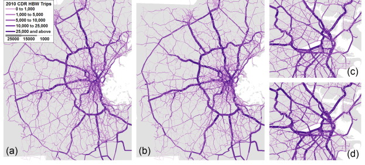

<b>Citation & Details</b>

**Citation (APA):** Alexander, L., Jiang, S., Murga, M., & González, M. C. (2015). Origin–destination trips by purpose and time of day inferred from mobile phone data. *Transportation Research Part C: Emerging Technologies*, 58, 240-250.

**Link:** [[paper]](https://doi.org/10.1016/j.trc.2015.02.018)

**Tag:** `flow`

---

### 2017-Xu-J R Soc Interface
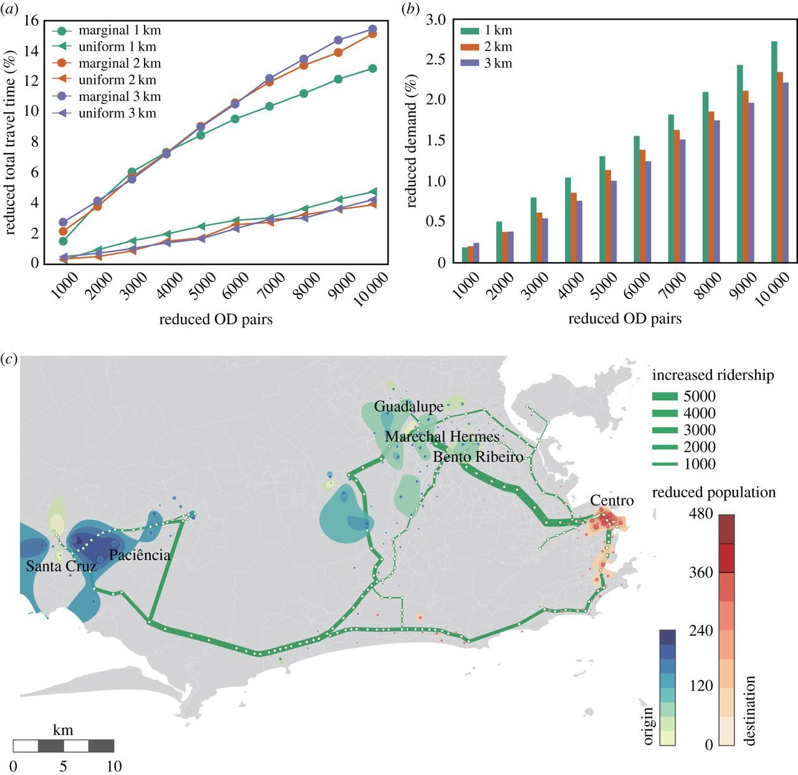

<b>Citation & Details</b>

**Citation (APA):** Xu, Y., & González, M. C. (2017). Collective benefits in traffic during mega events via the use of information technologies. *Journal of The Royal Society Interface*, 14(129), 20161041.

**Link:** [[paper]](https://doi.org/10.1098/rsif.2016.1041)

**Tag:** `flow`

**Color:** #359C7D #D15F2E #6E72A6

