<h2> Why Awesome Scientific Figures? </h2>

 

Scientific figures are essential for communicating research, yet strong examples are scarce and hard to find. This collection gathers outstanding figures to:

- **Learn visualization techniques** for presenting complex ideas
- **Explore styles** across figure types and disciplinary practices
- **Find inspiration** for papers, slides, and projects

<h2> Table of Contents </h2>

- [Geographical Map](#geographical-map)
- [Combination Fig](#combination-fig)
- [Boxplot](#boxplot)
- [Scatter](#scatter)
- [Other Publications](#other-publications)
- [Classical](#classical)

## Geographical Map

<h3>2021-Xu-Tour Manag</h3>

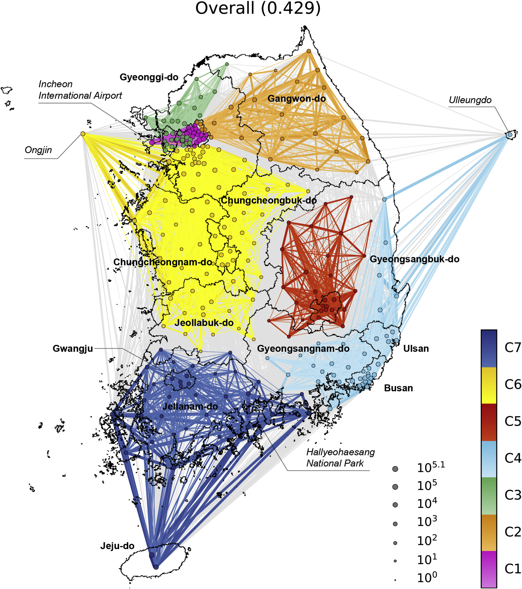

<b>Citation & Details</b>

**Citation (APA):** Xu, Y., Li, J., Belyi, A., & Park, S. (2021). Characterizing destination networks through mobility traces of international tourists—A case study using a nationwide mobile positioning dataset. *Tourism Management*, 82, 104195.

**Link:** [[paper]](https://doi.org/10.1016/j.tourman.2020.104195)

**Tag:** `flow`

**Color:** `#2A4291` `#F8CA13` `#C00005` `#64C9EA` `#58AF63` `#E98A02` `#DE24CE`

---

<h3>2021-Xu-Ann AAG</h3>
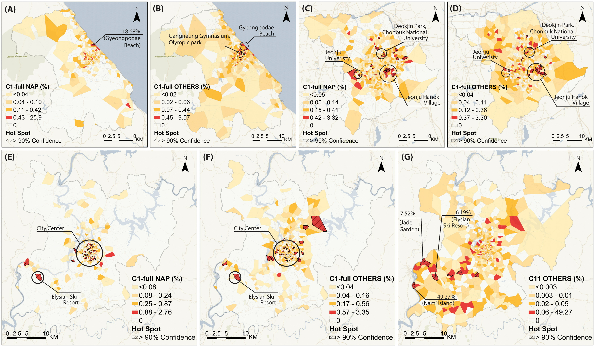

<b>Citation & Details</b>

**Citation (APA):** Xu, Y., Li, J., Xue, J., Park, S., & Li, Q. (2021). Tourism geography through the lens of time use: A computational framework using fine-grained mobile phone data. *Annals of the American Association of Geographers*, 111(5), 1420-1444.

**Link:** [[paper]](https://doi.org/10.1080/24694452.2020.1812372)

**Tag:** `notation`

**Color:** `#FDEDBD` `#FCDA9B` `#FDBD39` `#E83D39` `#F7F7EF`

---

<h3>2026-Peng-Nature Geoscience</h3>
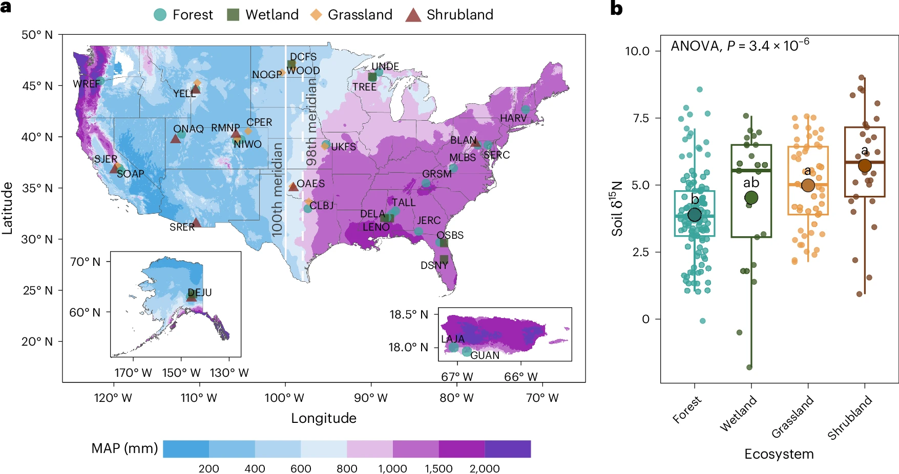

<b>Citation & Details</b>

**Citation (APA):** Peng, Y., Luo, J., Guo, L., Chen, H., Gao, Y., Peng, Z., & Liu, L. (2026). Precipitation threshold-driven shifts in dominant controls of ecosystem nitrogen retention. *Nature Geoscience*, 1-7.

**Link:** [[paper]](https://doi.org/10.1038/s41561-026-01992-5)

**Tag:** `colorbar`

**Color:** `#4BA6E0` `#7FBFE9` `#B0D4F1` `#DAEAF7` `#E2BDE7` `#BA68C8` `#9D27B0` `#683AB7`

---

<h3>2019-Xu-CEUS</h3>
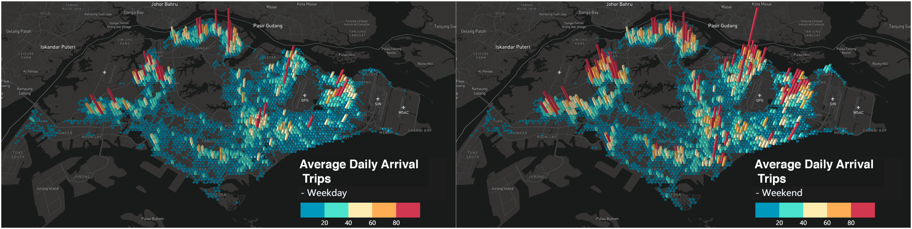

<b>Citation & Details</b>

**Citation (APA):** Xu, Y., Chen, D., Zhang, X., Tu, W., Chen, Y., Shen, Y., & Ratti, C. (2019). Unravel the landscape and pulses of cycling activities from a dockless bike-sharing system. *Computers, Environment and Urban Systems*, 75, 184-203.

**Link:** [[paper]](https://doi.org/10.1016/j.compenvurbsys.2019.02.002)

**Tag:** `3D`

**Color:** `#0098BD` `#4BE3CE` `#FEEDB0` `#FEAC54` `#D1374F`

---

## Combination Fig

<h3>2020-Gibbs-Nat Commun</h3>
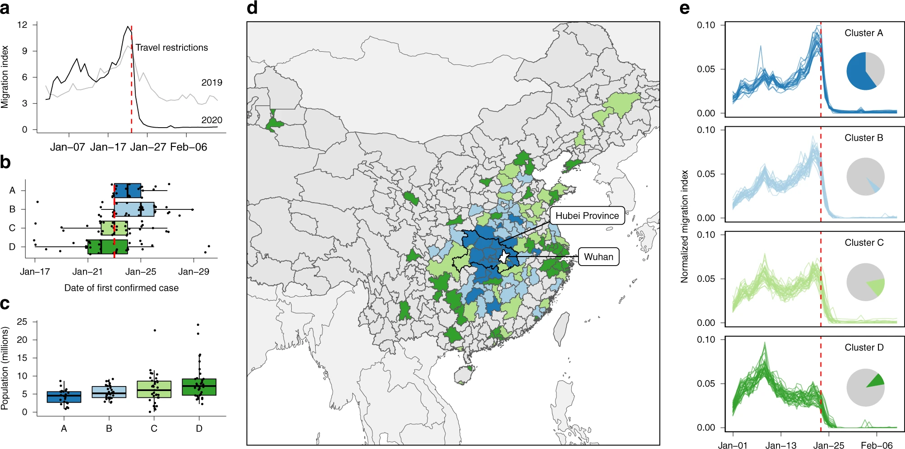

<b>Citation & Details</b>

**Citation (APA):** Gibbs, H., Liu, Y., Pearson, C. A., Jarvis, C. I., Grundy, C., Quilty, B. J., ... & Eggo, R. M. (2020). Changing travel patterns in China during the early stages of the COVID-19 pandemic. *Nature Communications*, 11(1), 1-9.

**Link:** [[paper]](https://doi.org/10.1038/s41467-020-18783-0)

**Tag:** `cluster`

**Color:** `#1E78B5` `#A6CEE3` `#B4DF8A` `#32A02D`

---

<h3>2022-Yabe-CEUS</h3>
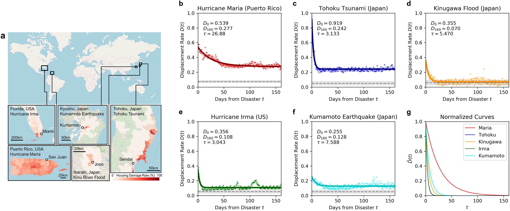

<b>Citation & Details</b>

**Citation (APA):** Yabe, T., Jones, N. K., Rao, P. S. C., Gonzalez, M. C., & Ukkusuri, S. V. (2022). Mobile phone location data for disasters: A review from natural hazards and epidemics. *Computers, Environment and Urban Systems*, 94, 101777.

**Link:** [[paper]](https://doi.org/10.1016/j.compenvurbsys.2022.101777)

**Tag:** `cross`

**Color:** `#FE0505` `#0B0CFE` `#FF9D03` `#007701` `#03FFFE`

---

<h3>2022-Tegally-Science</h3>
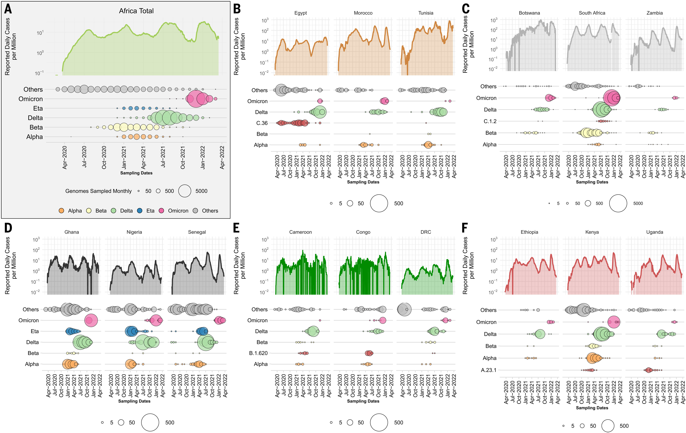
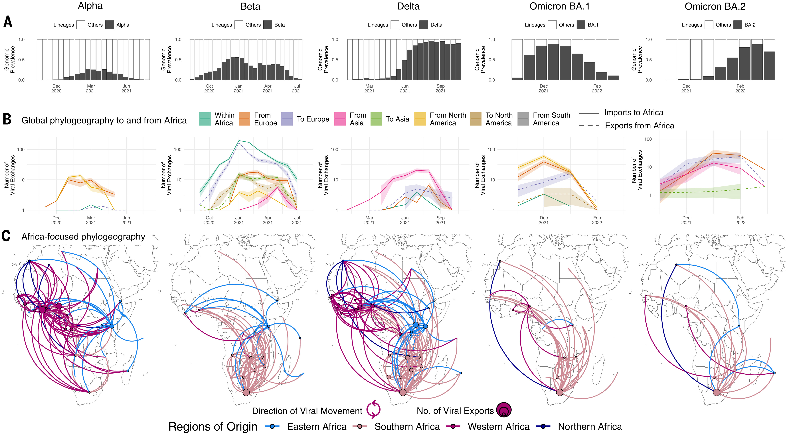

<b>Citation & Details</b>

**Citation (APA):** Tegally, H., San, J. E., Cotten, M., Tegomoh, B., Mboowa, G., Martin, D. P., ... & Omunakwe, H. E. (2022). The evolving SARS-CoV-2 epidemic in Africa: Insights from rapidly expanding genomic surveillance. *Science*, 378(6615), eabq5358.

**Link:** [[paper]](https://doi.org/10.1126/science.abq5358)

**Tag:** `period`

**Color:** `#FDAE61` `#FFFFBF` `#ACDDA5` `#2E84BC` `#EE6AA6` `#BEBEBE` `#189E78` `#DA5F00` `#7570B3` `#E7288A` `#66A51E` `#E5AA05` `#A6751D` `#666666`

---

<h3>2019-Yin-Nature</h3>
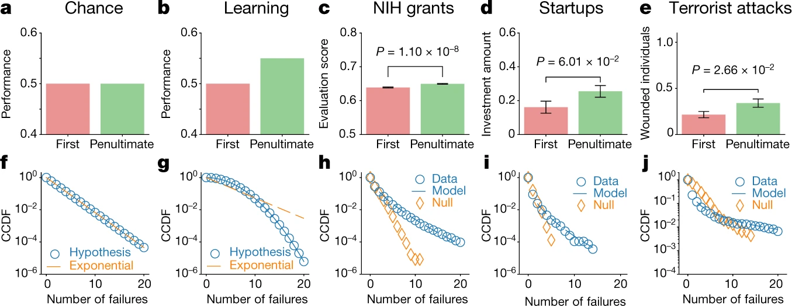

<b>Citation & Details</b>

**Citation (APA):** Yin, Y., Wang, Y., Evans, J. A., & Wang, D. (2019). Quantifying the dynamics of failure across science, startups and security. *Nature*, 575(7781), 190-194.

**Link:** [[paper]](https://doi.org/10.1038/s41586-019-1725-y)

**Tag:** `font`

**Color:** `#EA9493` `#95CF95` `#3081AF` `#F18125`

---

<h3>2020-Alessandretti-Nature</h3>
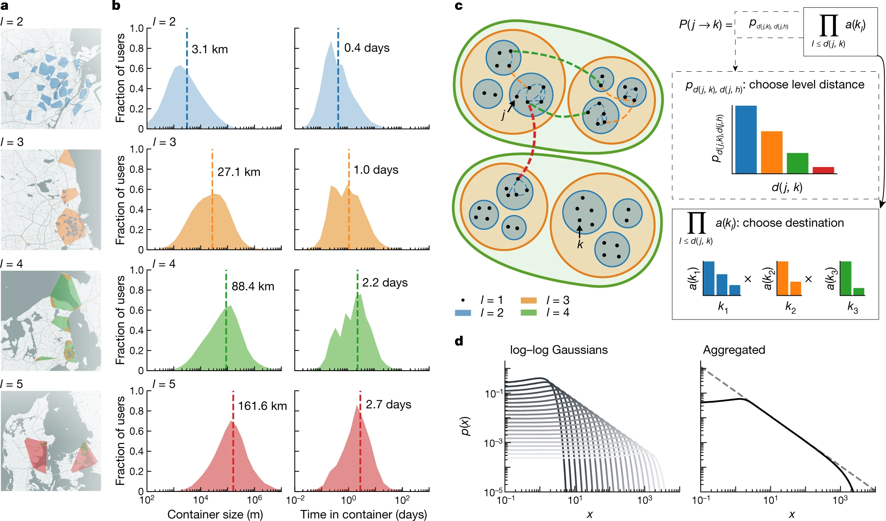

<b>Citation & Details</b>

**Citation (APA):** Alessandretti, L., Aslak, U., & Lehmann, S. (2020). The scales of human mobility. *Nature*, 587(7834), 402-407.

**Link:** [[paper]](https://doi.org/10.1038/s41586-020-2909-1)

**Tag:** `echo`

**Color:** `#2177B5` `#FF800E` `#2BA02B` `#D72927`

---

<h3>2022-Ren-Tour Manag</h3>
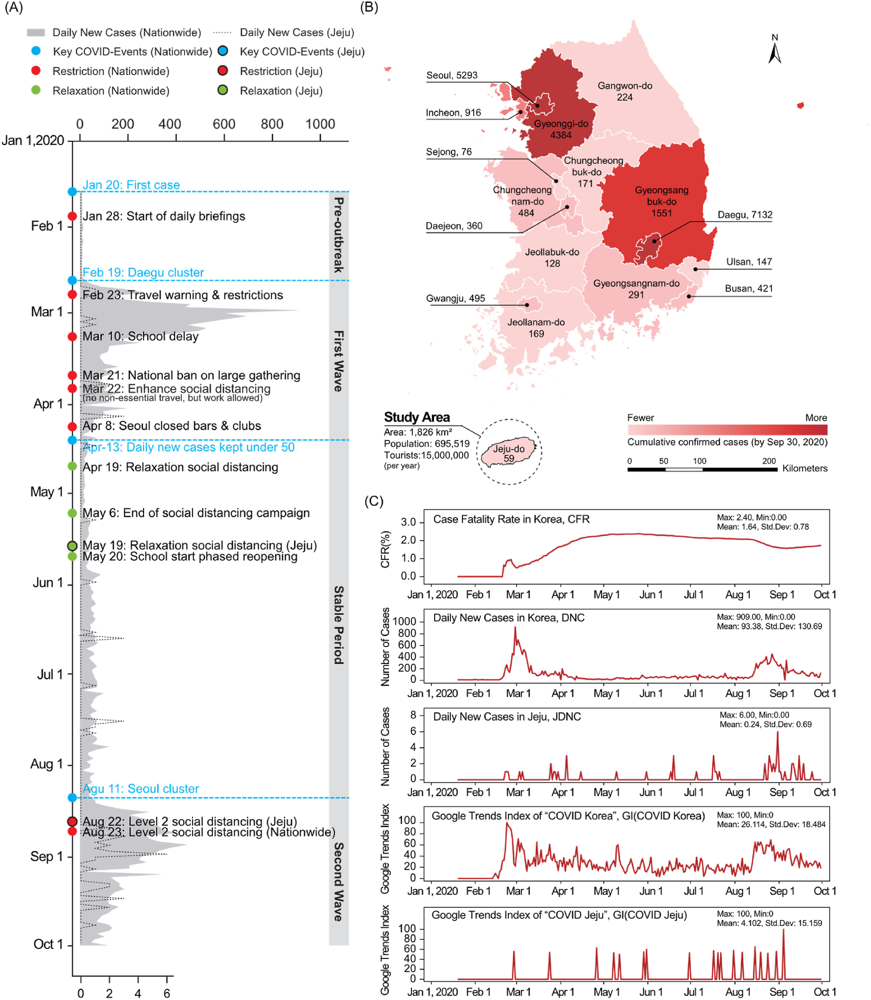

<b>Citation & Details</b>

**Citation (APA):** Ren, M., Park, S., Xu, Y., Huang, X., Zou, L., Wong, M. S., & Koh, S. Y. (2022). Impact of the COVID-19 pandemic on travel behavior: A case study of domestic inbound travelers in Jeju, Korea. *Tourism Management*, 92, 104533.

**Link:** [[paper]](https://doi.org/10.1016/j.tourman.2022.104533)

**Tag:** `event`

---

<h3>2025-Chen-Cities</h3>
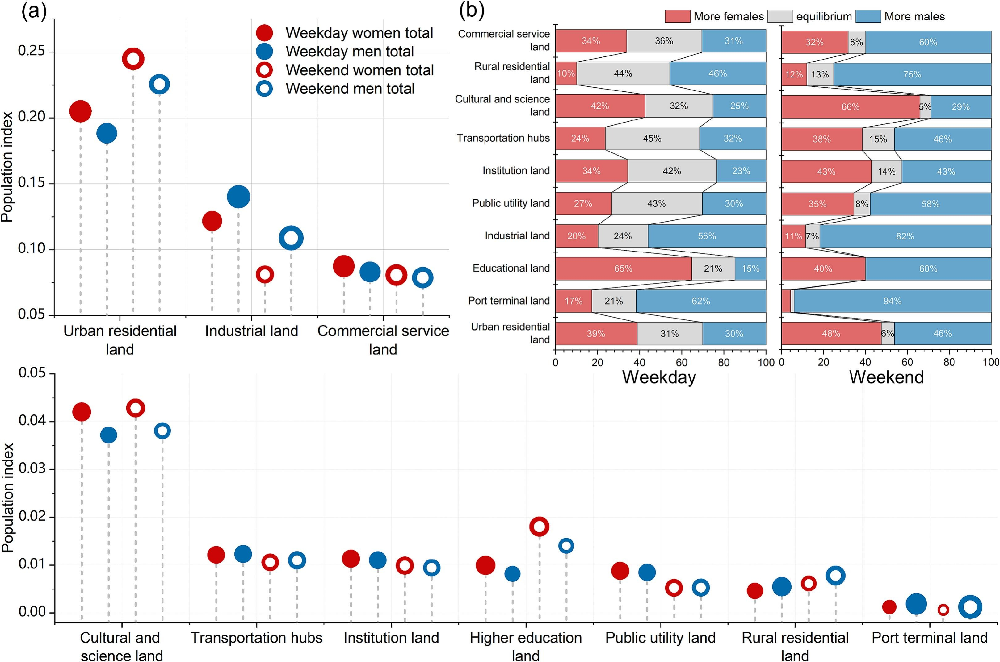

<b>Citation & Details</b>

**Citation (APA):** Chen, Y., Zhang, H., Wang, G., Jiang, S., Chen, L., & Zhang, L. (2025). Gendered urban spaces: Unveiling gender segregation through time, space, and behavior-A case study of Zhuhai, China. *Cities*, 166, 106241.

**Link:** [[paper]](https://doi.org/10.1016/j.cities.2025.106241)

**Tag:** `contrast`

---

<h3>2025-Cui-NC</h3>
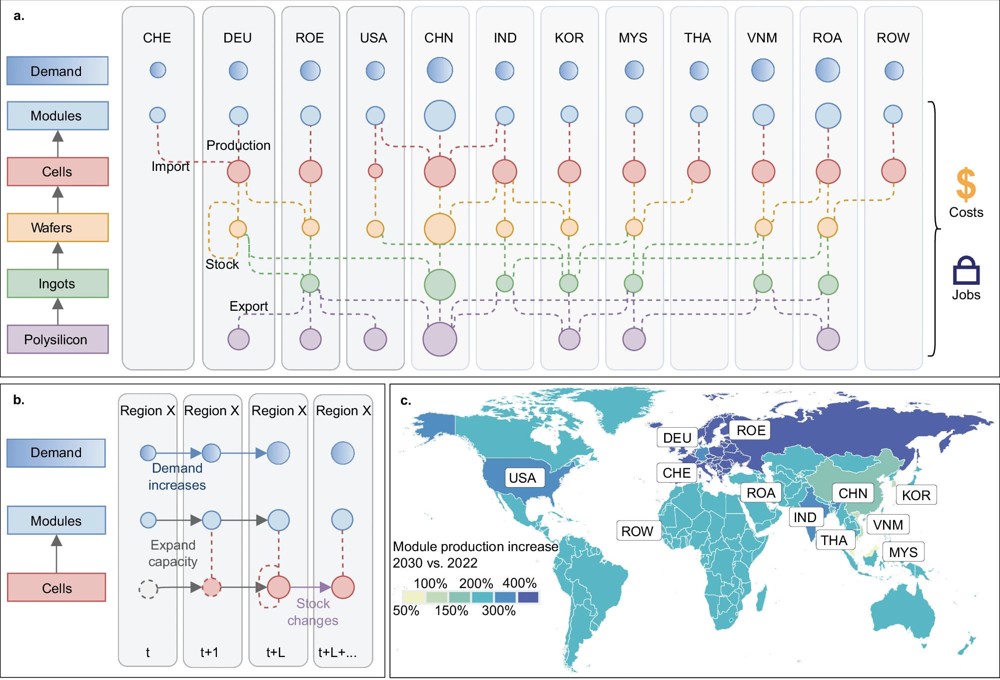

<b>Citation & Details</b>

**Citation (APA):** Cui, C., Lonergan, K.E. & Sansavini, G. (2025). Policy-driven transformation of global solar PV supply chains and resulting impacts. *Nat Commun* 16, 6742.

**Link:** [[paper]](https://doi.org/10.1038/s41467-025-61979-5)

**Tag:** `process`

---

<h3>2026-Li-Nature</h3>
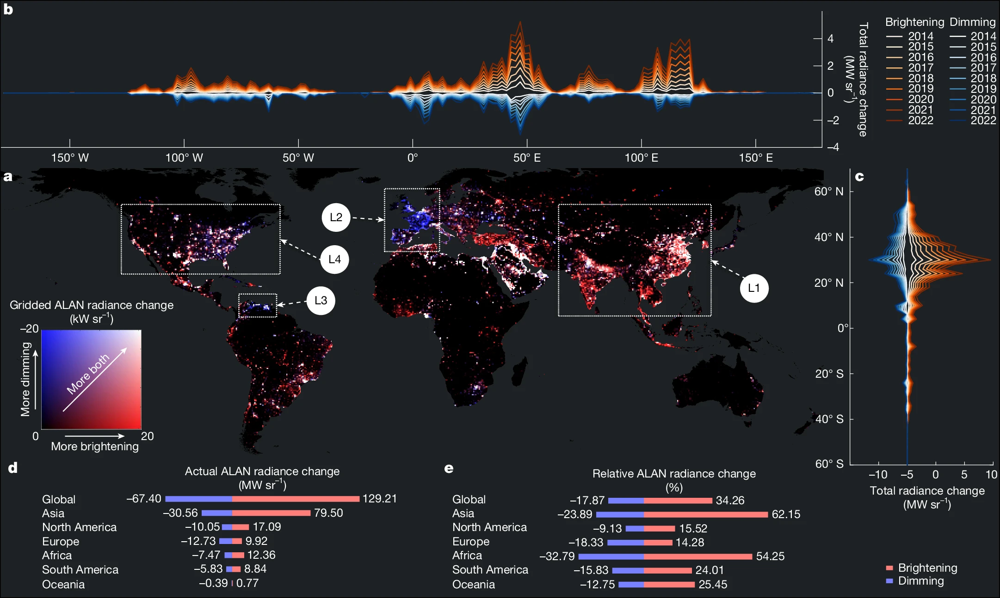

<b>Citation & Details</b>

**Citation (APA):** Li, T., Wang, Z., Kyba, C., Román, M. O., Seto, K. C., Yang, Y., ... & Zhu, Z. (2026). Satellite imagery reveals increasing volatility in human night-time activity. *Nature*, 652(8109), 379-386.

**Link:** [[paper]](https://doi.org/10.1038/s41586-026-10260-w)

**Tag:** `bivariate`

---

<h3>2026-Yang-Nat Comput Sci</h3>
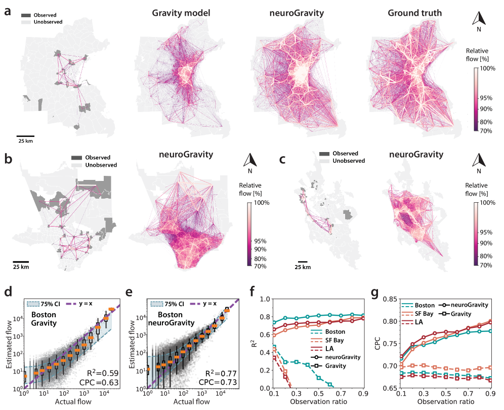

<b>Citation & Details</b>

**Citation (APA):** Yang, J., Huang, S., Huang, Z., Jin, Y., Yang, X., González, M. C., & Xu, Y. (2026). Transferable human mobility network reconstruction with neuroGravity. *Nature Computational Science*, 6(6), 630-641.

**Link:** [[paper]](https://doi.org/10.1038/s43588-026-01003-y)

**Tag:** `distribution`

---

## Boxplot

<h3>2022-Xu-CEUS</h3>
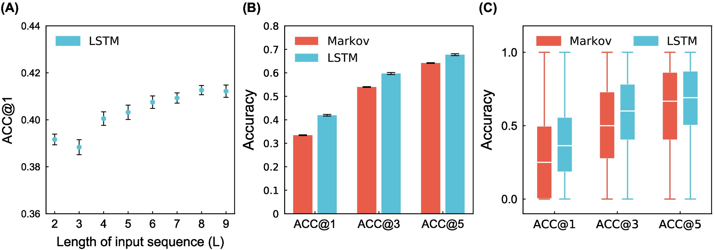

<b>Citation & Details</b>

**Citation (APA):** Xu, Y., Zou, D., Park, S., Li, Q., Zhou, S., & Li, X. (2022). Understanding the movement predictability of international travelers using a nationwide mobile phone dataset collected in South Korea. *Computers, Environment and Urban Systems*, 92, 101753.

**Link:** [[paper]](https://doi.org/10.1016/j.compenvurbsys.2021.101753)

**Tag:** `comparison`

**Color:** `#E95C49` `#5AC0D7`

---

<h3>2022-Jin-Emerg Microbes Infect</h3>
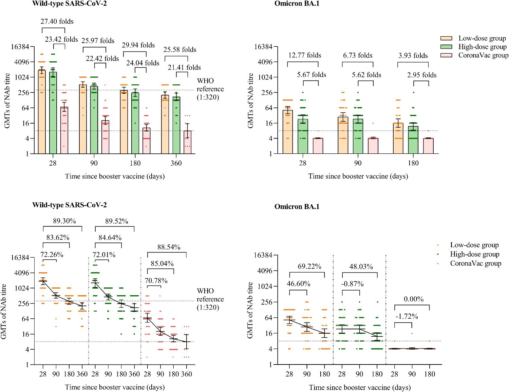

<b>Citation & Details</b>

**Citation (APA):** Jin, L., Tang, R., Wu, S., Guo, X., Huang, H., Hou, L., ... & Zhu, F. (2022). Antibody persistence and safety after heterologous boosting with orally aerosolised Ad5-nCoV in individuals primed with two-dose CoronaVac previously: twelve-month analyses of a randomized controlled trial. *Emerging Microbes & Infections*, (just-accepted), 1-20.

**Link:** [[paper]](https://doi.org/10.1080/22221751.2022.2155251)

**Tag:** `comparison` `confidence`

**Color:** `#FEE0BE` `#A8DCA5` `#FFE1E0`

---

## Scatter

<h3>2010-Song-Nat Phys</h3>
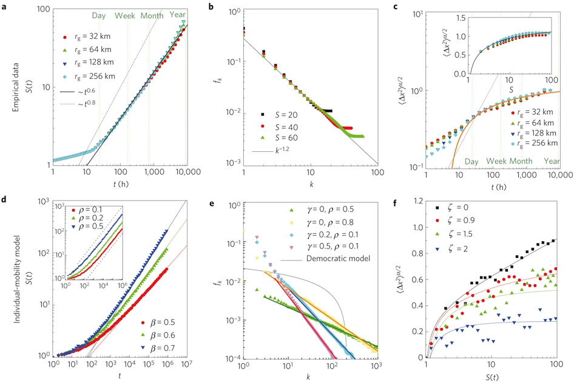

<b>Citation & Details</b>

**Citation (APA):** Song, C., Koren, T., Wang, P., & Barabási, A. L. (2010). Modelling the scaling properties of human mobility. *Nature Physics*, 6(10), 818-823.

**Link:** [[paper]](https://doi.org/10.1038/nphys1760)

**Tag:** `fit`

---

<h3>2009-Wang-Science</h3>
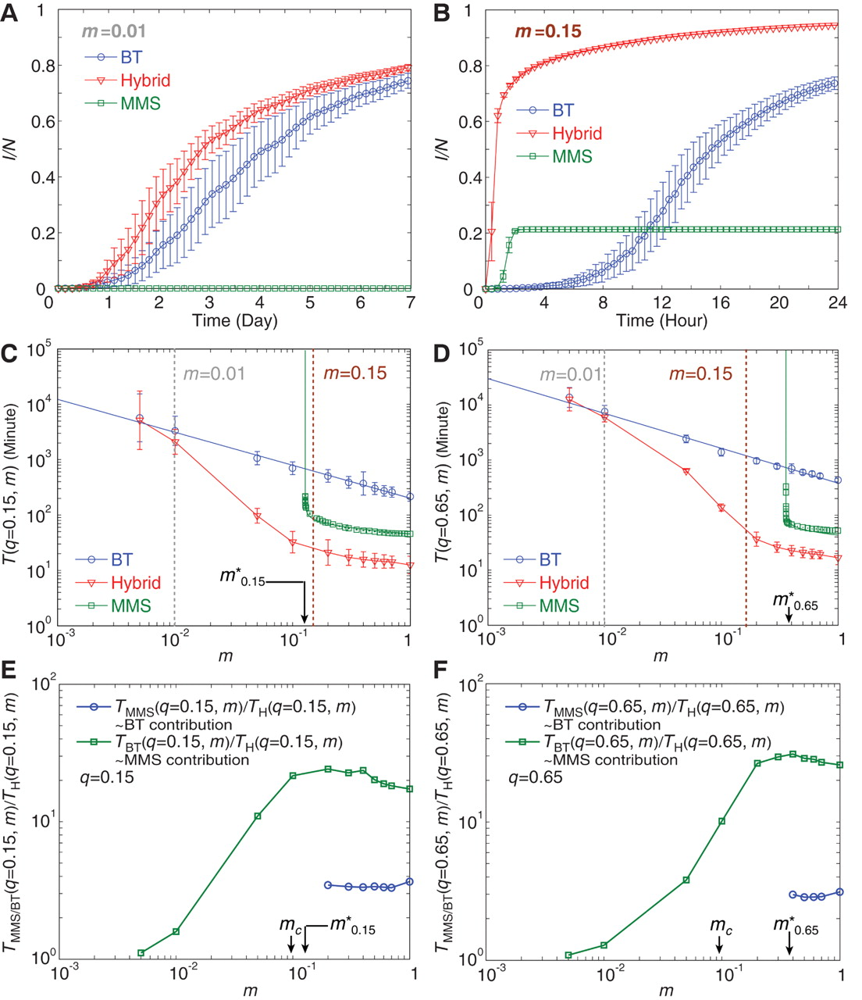

<b>Citation & Details</b>

**Citation (APA):** Wang, P., González, M. C., Hidalgo, C. A., & Barabási, A. L. (2009). Understanding the spreading patterns of mobile phone viruses. *Science*, 324(5930), 1071-1076.

**Link:** [[paper]](https://doi.org/10.1126/science.1167053)

**Tag:** `fit`

**Color:** `#375294` `#D93431` `#1F7E46`

---

<h3>2019-Xu-J R Soc Interface</h3>
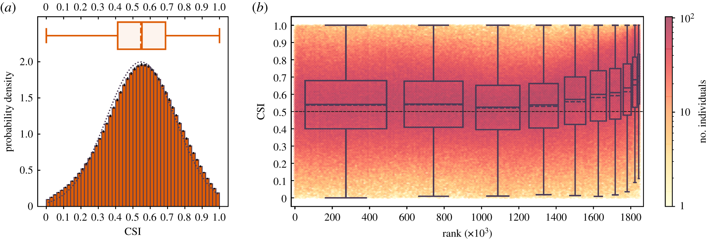

<b>Citation & Details</b>

**Citation (APA):** Xu, Y., Belyi, A., Santi, P., & Ratti, C. (2019). Quantifying segregation in an integrated urban physical-social space. *Journal of the Royal Society Interface*, 16(160), 20190536.

**Link:** [[paper]](https://doi.org/10.1098/rsif.2019.0536)

**Tag:** `distribution`

---

<h3>2025-Ibrahim-Fundam Res</h3>
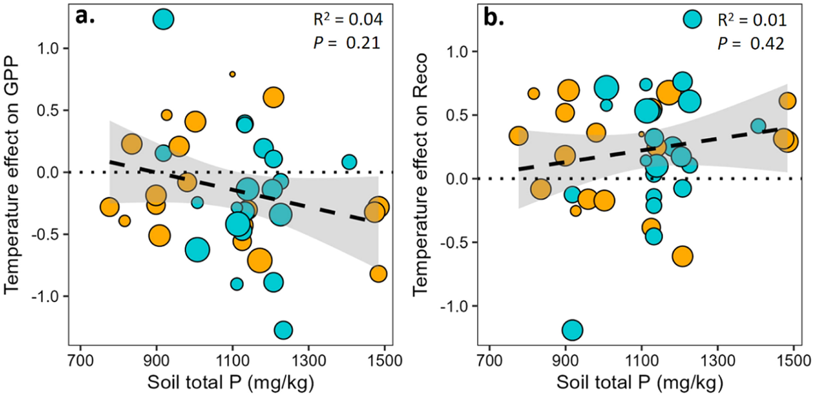

<b>Citation & Details</b>

**Citation (APA):** Ibrahim, M. M., & Hou, E. (2025). Soil phosphorus regulates summer CO2 flux response to air temperature in nitrogen-poor northern permafrost ecosystems. *Fundamental Research*.

**Link:** [[paper]](https://doi.org/10.1016/j.fmre.2025.04.005)

**Tag:** `fit`

**Color:** `#00CBD2` `#FFAA01`

---

<h3>2026-Liang-Travel Behav Soc</h3>

<b>Citation & Details</b>

**Citation (APA):** Liang, S., Xu, Y., Li, G., Zhang, X., & Li, Q. (2026). Predicting short-term urban bike sharing demand in a coupled continuous and network space. *Travel Behaviour and Society*, 42, 101152.

**Link:** [[paper]](https://doi.org/10.1016/j.tbs.2025.101152)

**Tag:** `trend`

**Color:** `#1DBDE6` `#F1515E`

---

## Other Publications

<h3>2019-Raval-FT</h3>

<b>Citation & Details</b>

**Citation:** Raval, A., Spero, J., & Campbell, C. (2019). Pollution: the race to clean up the shipping industry. *Financial Times*, 9-10.

**Link:** [[article in newspaper]](https://www.ft.com/content/642b6b62-70ab-11e9-bf5c-6eeb837566c5)

**Tag:** `flow`

---

<h3>2024-News Media Organization-Economist</h3>
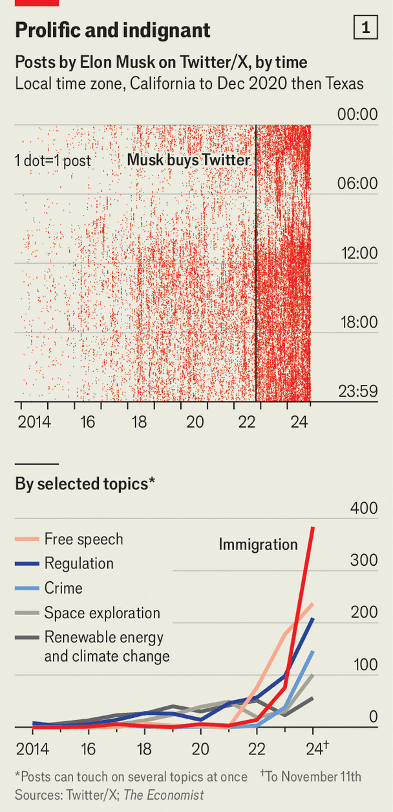

<b>Citation & Details</b>

**Citation:** Elon Musk's transformation, in his own words. (2024, Nov 21). *The Economist*

**Link:** [[article in newspaper]](https://www.economist.com/briefing/2024/11/21/elon-musks-transformation-in-his-own-words)

**Tag:** `heatmap`

---

<h3>2022-Max Roser-Our World in Data</h3>

<b>Citation & Details</b>

**Citation:** Max Roser. (2022). The future is vast – what does this mean for our own life? *Our World in Data*

**Link:** [[article in open project]](https://ourworldindata.org/the-future-is-vast)

**Tag:** `quantitative`

---

## Classical

<h3>2012-Fang-J Transp Geog</h3>
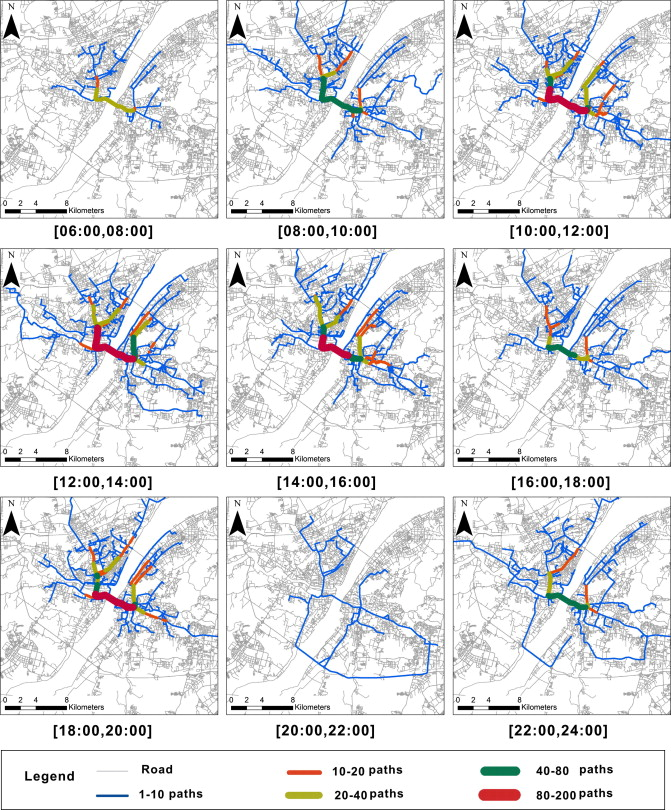

<b>Citation & Details</b>

**Citation (APA):** Fang, Z., Shaw, S. L., Tu, W., Li, Q., & Li, Y. (2012). Spatiotemporal analysis of critical transportation links based on time geographic concepts: a case study of critical bridges in Wuhan, China. *Journal of Transport Geography*, 23, 44-59.

**Link:** [[paper]](https://doi.org/10.1016/j.jtrangeo.2012.03.018)

**Tag:** `flow`

---

<h3>2015-Alexander-Transp Res</h3>
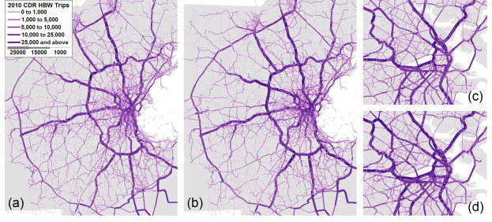

<b>Citation & Details</b>

**Citation (APA):** Alexander, L., Jiang, S., Murga, M., & González, M. C. (2015). Origin–destination trips by purpose and time of day inferred from mobile phone data. *Transportation Research Part C: Emerging Technologies*, 58, 240-250.

**Link:** [[paper]](https://doi.org/10.1016/j.trc.2015.02.018)

**Tag:** `flow`

---

<h3>2016-Jiang-PNAS</h3>
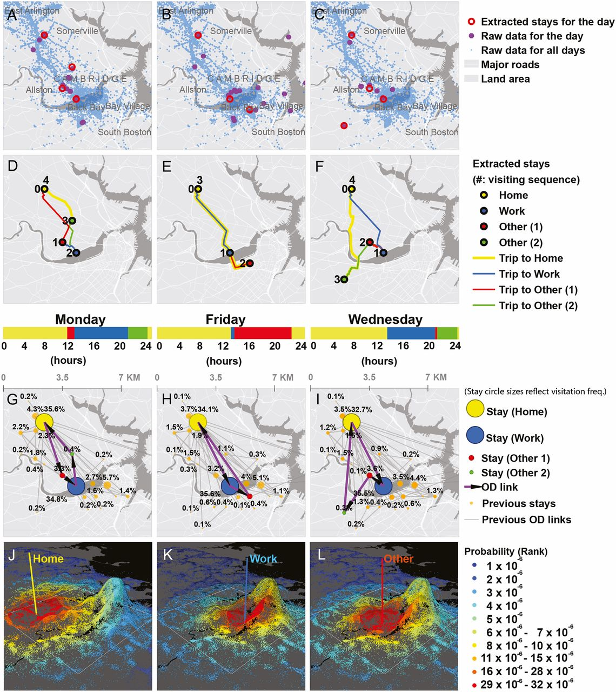

<b>Citation & Details</b>

**Citation (APA):** Jiang, S., Yang, Y., Gupta, S., Veneziano, D., Athavale, S., & González, M. C. (2016). The TimeGeo modeling framework for urban mobility without travel surveys. *Proceedings of the National Academy of Sciences*, 113(37), E5370-E5378.

**Link:** [[paper]](https://doi.org/10.1073/pnas.1524261113)

**Tag:** `prob`

**Color:** `#EFE541` `#296AB2` `#E40519` `#75B728`

---

<h3>2017-Xu-J R Soc Interface</h3>
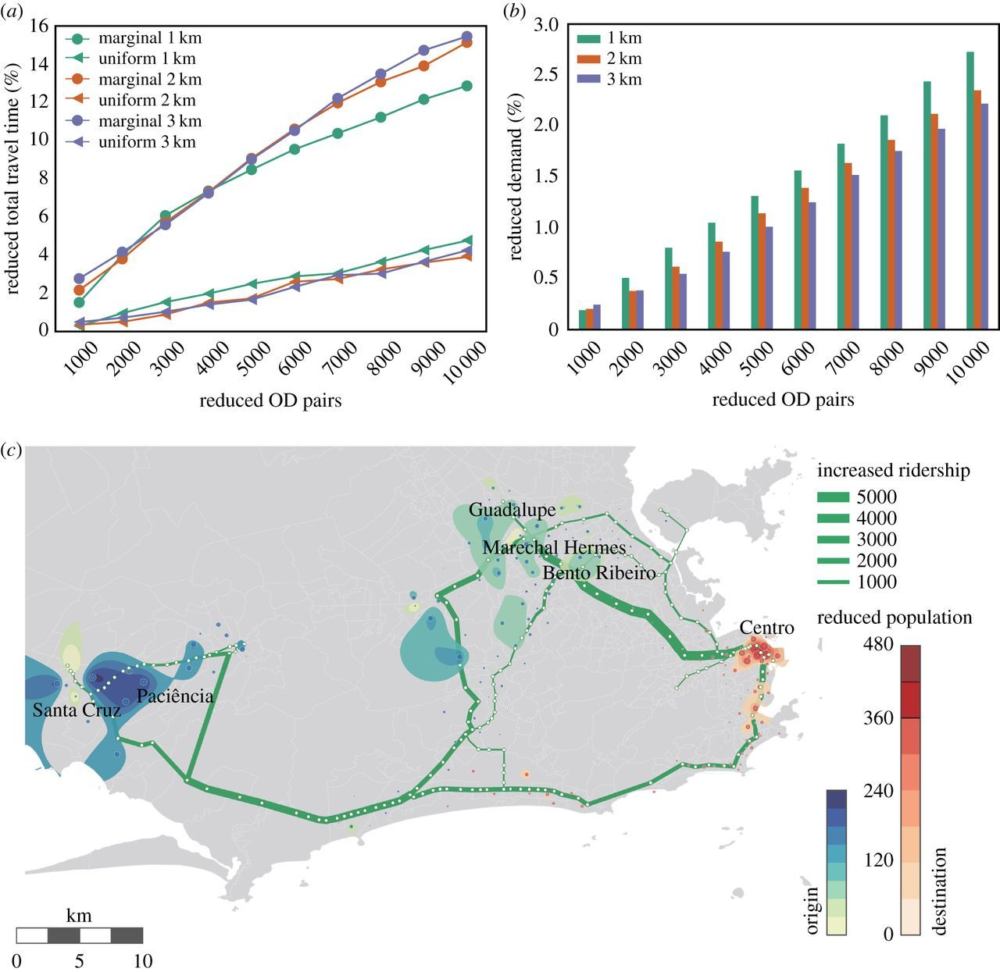

<b>Citation & Details</b>

**Citation (APA):** Xu, Y., & González, M. C. (2017). Collective benefits in traffic during mega events via the use of information technologies. *Journal of The Royal Society Interface*, 14(129), 20161041.

**Link:** [[paper]](https://doi.org/10.1098/rsif.2016.1041)

**Tag:** `flow`

**Color:** `#359C7D` `#D15F2E` `#6E72A6`

Pull requests are welcome. Please feel free to raise [pull requests](https://github.com/nehSgnaiL/awesome-scientific-figure/pulls) to add new recommendations based on the [specs](CONTRIBUTING.md).
