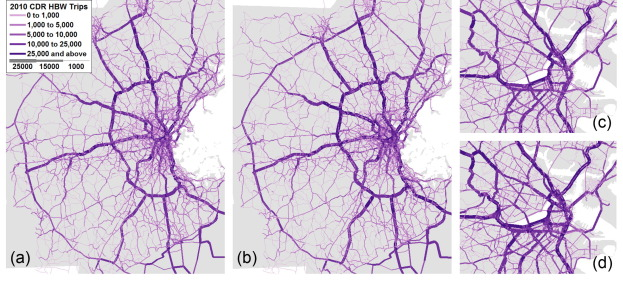

# Awesome Scientific Figure

 

A curated list of scientific figures in research papers.

## Contributing
Pull requests are welcome, please feel free to raise [pull requests](https://github.com/nehSgnaiL/awesome-scientific-figure/pulls) to add new recommendation.

## Geographic map

| Figure                                                                                        | Citation                                                                                                                                                                                                                                             | Link                                                     | Tag       |
|-----------------------------------------------------------------------------------------------|------------------------------------------------------------------------------------------------------------------------------------------------------------------------------------------------------------------------------------------------------|----------------------------------------------------------|-----------|
|  | > Xu, Y., Li, J., Belyi, A., & Park, S. (2021). Characterizing destination networks through mobility traces of international tourists—A case study using a nationwide mobile positioning dataset. *Tourism Management*, 82, 104195.                  | [[paper]](https://doi.org/10.1016/j.tourman.2020.104195) | `od flow`  |
|            | > Xu, Y., Li, J., Xue, J., Park, S., & Li, Q. (2021). Tourism geography through the lens of time use: A computational framework using fine-grained mobile phone data. *Annals of the American Association of Geographers*, 111(5), 1420-1444.        | [[paper]](https://doi.org/10.1080/24694452.2020.1812372) | `notation` |
|      | > Fang, Z., Shaw, S. L., Tu, W., Li, Q., & Li, Y. (2012). Spatiotemporal analysis of critical transportation links based on time geographic concepts: a case study of critical bridges in Wuhan, China. *Journal of Transport Geography*, 23, 44-59. | [[paper]](https://doi.org/10.1016/j.jtrangeo.2012.03.018) | `traffic flow` |
|       | > Alexander, L., Jiang, S., Murga, M., & González, M. C. (2015). Origin–destination trips by purpose and time of day inferred from mobile phone data. *Transportation Research Part C: Emerging Technologies*, 58, 240-250.                          | [[paper]](https://doi.org/10.1016/j.trc.2015.02.018) | `traffic flow` |

## Combination Fig

| Figure                                                                                           | Citation                                                                                                                                                                                                                           | Link                                                     | Tag         |
|--------------------------------------------------------------------------------------------------|------------------------------------------------------------------------------------------------------------------------------------------------------------------------------------------------------------------------------------|----------------------------------------------------------|-------------|
|       | > Gibbs, H., Liu, Y., Pearson, C. A., Jarvis, C. I., Grundy, C., Quilty, B. J., ... & Eggo, R. M. (2020). Changing travel patterns in China during the early stages of the COVID-19 pandemic. *Nature Communications*, 11(1), 1-9. | [[paper]](https://doi.org/10.1038/s41467-020-18783-0) | `cluster`     |
|  | > Yabe, T., Jones, N. K., Rao, P. S. C., Gonzalez, M. C., & Ukkusuri, S. V. (2022). Mobile phone location data for disasters: A review from natural hazards and epidemics. *Computers, Environment and Urban Systems*, 94, 101777. | [[paper]](https://doi.org/10.1016/j.compenvurbsys.2022.101777) | `across cities`     |

## Scatter

| Figure                                                                                                | Citation                                                                                                                                                              | Link                                                     | Tag       |
|-------------------------------------------------------------------------------------------------------|-----------------------------------------------------------------------------------------------------------------------------------------------------------------------|----------------------------------------------------------|-----------|
|  | > Song, C., Koren, T., Wang, P., & Barabási, A. L. (2010). Modelling the scaling properties of human mobility. *Nature Physics*, 6(10), 818-823.                      | [[paper]](https://doi.org/10.1038/nphys1760) | `model fit` |
|                               | > Wang, P., González, M. C., Hidalgo, C. A., & Barabási, A. L. (2009). Understanding the spreading patterns of mobile phone viruses. *Science*, 324(5930), 1071-1076. | [[paper]](https://doi.org/10.1126/science.1167053) | `model fit` |

## Boxplot

| Figure                                                                                       | Citation                                                                                                                                                                                                                                                       | Link                                                     | Tag                |
|----------------------------------------------------------------------------------------------|----------------------------------------------------------------------------------------------------------------------------------------------------------------------------------------------------------------------------------------------------------------|----------------------------------------------------------|--------------------|
|  | > Xu, Y., Zou, D., Park, S., Li, Q., Zhou, S., & Li, X. (2022). Understanding the movement predictability of international travelers using a nationwide mobile phone dataset collected in South Korea. *Computers, Environment and Urban Systems*, 92, 101753. | [[paper]](https://doi.org/10.1016/j.compenvurbsys.2021.101753) | `model comparison` |

## Other publications

| Figure                                                                                                 | Citation                                                                                                                     | Link                                                                             | Tag    |
|--------------------------------------------------------------------------------------------------------|------------------------------------------------------------------------------------------------------------------------------|----------------------------------------------------------------------------------|--------|
|  | > Raval, A., Spero, J., & Campbell, C. (2019). Pollution: the race to clean up the shipping industry. *Financial Times*, 9-10. | [[article in newspaper]](https://www.ft.com/content/642b6b62-70ab-11e9-bf5c-6eeb837566c5) | `flow` |

